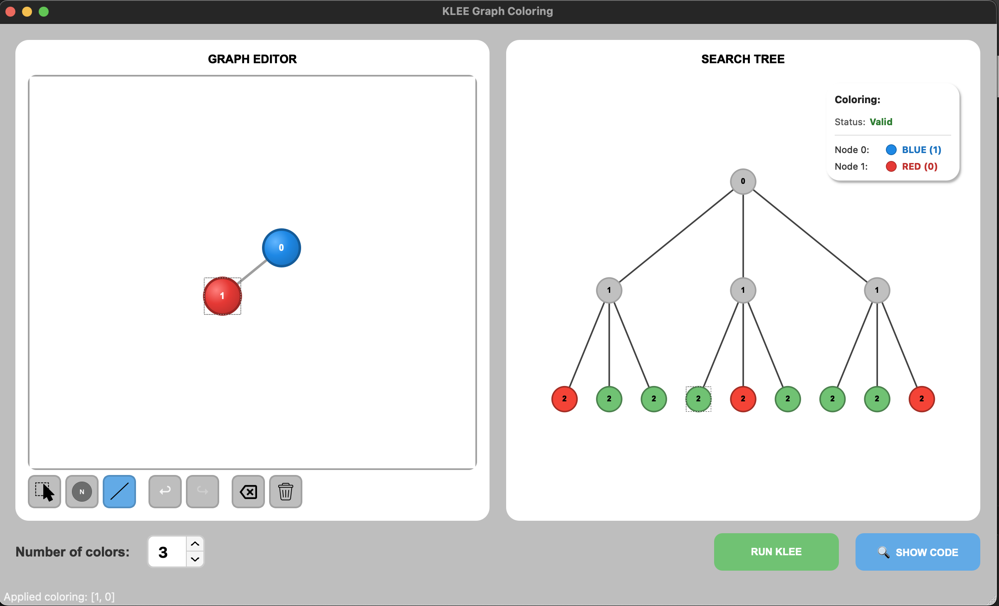
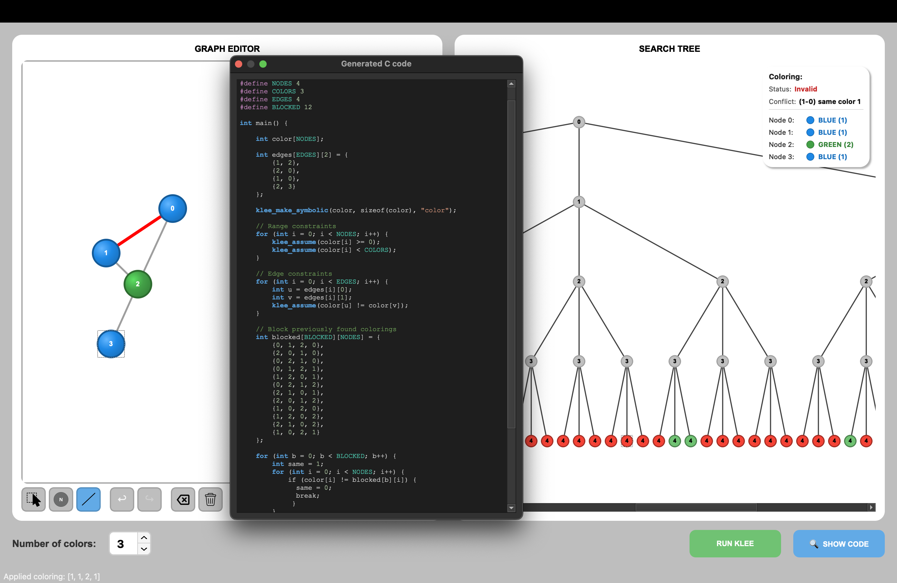

# 2026_Research_Symbolic-Tree-Search-Graph-Coloring

A **software verification** project that uses **KLEE symbolic execution** to explore all possible graph colorings and visualize the complete search tree.
This project demonstrates core principles of **formal software verification** through symbolic execution.

### Symbolic Execution with KLEE
Instead of testing a program with concrete inputs, **symbolic execution** treats inputs as symbolic variables and explores *all possible execution paths*. KLEE (a symbolic execution engine built on LLVM) systematically generates test cases that cover every feasible path through the program.

In our case:
- **Input**: A graph with `n` nodes and `k` available colors
- **Constraints**: Adjacent nodes must have different colors (`klee_assume(color[i] != color[j])`)
- **Output**: All valid colorings that satisfy the constraints

This transforms the NP-complete graph coloring problem into a **constraint satisfaction problem** solved through symbolic execution - a technique used in real-world software verification to find bugs, prove correctness, and generate comprehensive test suites.

## Features

- **Visual Graph Editor** — Create graphs interactively using PyQt5
- **Automatic C Code Generation** — Translates your graph into KLEE-compatible C code
- **KLEE Integration** — Runs symbolic execution and parses `.ktest` result files
- **Search Tree Visualization** — Displays the complete k-ary search tree where:
  - **Green leaves** = Valid colorings (satisfying all constraints)
  - **Red leaves** = Invalid colorings (constraint violations)
  - **Gray internal nodes** = Partial assignments
- **Interactive Exploration**:
  - Click any **green leaf** → Graph is colored accordingly, info panel shows the coloring
  - Click any **red leaf** → Info panel explains *why* the coloring is invalid
  - Click any **internal node** → Shows partial coloring state
- **Accessibility Support** — Color information is also displayed as text in the info panel, making the application usable for colorblind users (see ISO/IEC 25010 note below)


## Project Structure

```
2026_RESEARCH_SYMBOLIC_TREE_SEARCH_GRAPH_COLORING/
├── main.py                        # Application entry point
├── requirements.txt               # Python dependencies
├── README.md
├── .gitignore
│
├── gui/                            # PyQt5 user interface
│   ├── __init__.py
│   ├── main_window.py              # Main application window
│   ├── actions.py                  # Undo/redo manager
│   ├── dialogs.py                  # Code viewer dialog
│   │
│   ├── graph_editor/               # Graph editor panel (left)
│   │   ├── __init__.py
│   │   ├── graph_scene.py          # Graph canvas and interaction logic
│   │   ├── graph_view.py           # Graph viewport widget
│   │   ├── node_item.py            # Visual node representation
│   │   └── edge_item.py            # Visual edge representation
│   │
│   └── search_tree/                # Search tree panel (right)
│       ├── __init__.py
│       ├── tree_view.py            # Search tree visualization widget
│       ├── tree_node_item.py       # Visual tree node representation
│       └── coloring_info_panel.py  # Coloring information panel
│
├── icons/                          # Toolbar icons (PNG/SVG)
│   ├── node.png
│   ├── edge.png
│   ├── select.png
│   ├── delete.png
│   ├── clear.png
|   ├── down.svg
|   └── up.png
|
├── klee/                           # KLEE integration layer
│   ├── __init__.py
│   ├── code_generator.py           # Graph → C code translation
│   ├── runner.py                   # KLEE execution wrapper
│   └── ktest_parser.py             # .ktest file parser
│
├── models/                         # Data models
|   ├── __init__.py
|   ├── graph.py                    # Node, Edge, GraphState, TreeNode, Tool classes
|   ├── klee_worker.py              # Background KLEE execution (QRunnable)
|   ├── settings.py                 # Theme, colors, fonts, dimensions, styles
|   └── tree_layout.py              # Search tree layout computation
|
├── screenshots/                    # Gallery
    ├── view.png
    ├── show_code.png
    └── demo.mp4
```

## Installation

### Prerequisites

1. **Python 3.11**
2. **KLEE** symbolic execution engine
3. **Clang/LLVM** compiler (for compiling C to LLVM bitcode)

### Installing KLEE

**Ubuntu/Debian:**
```bash
sudo apt install klee llvm clang
```

**macOS (Homebrew):**
```bash
brew install klee llvm
```

**Docker:**
```bash
docker pull klee/klee
```

### Installing Python Dependencies

```bash
pip install -r requirements.txt
```
## Usage

1. **Run the application:**
   ```bash
   python3 main.py
   ```

2. **Create a graph:**
   - Click on the canvas to add nodes
   - Switch to edge mode and click two nodes to connect them

3. **Set the number of colors** using the spin box

4. **View generated code** (optional):
   - Click **"Show Code"** to see the C code that will be sent to KLEE

5. **Run KLEE:**
   - Click the **"Run KLEE"** button
   - The search tree will be generated and displayed

6. **Explore the results:**
   - Click on tree nodes to see coloring information
   - Valid colorings will be applied to your graph
   - Invalid colorings show the constraint violation

## Accessibility (ISO/IEC 25010)

This application follows the **ISO/IEC 25010** software quality standard, specifically addressing the **Usability** quality attribute and its sub-characteristic **Accessibility**.

The coloring information panel provides textual descriptions of all color assignments, ensuring that:
- **Colorblind users** can understand which colors are assigned to which nodes
- **Screen reader users** can access the coloring information
- Color is never the *sole* means of conveying information

## Screenshots

### Graph Editor & Search Tree

*Simple graph with 2 nodes and 3 colors. The search tree shows all 9 possible colorings — 6 valid (green) and 3 invalid (red). Clicking a valid leaf applies the coloring to the graph.*

### Generated C Code & Conflict Detection

*A 4-node graph with the generated KLEE C code visible. The info panel shows an invalid coloring with conflict detection: nodes 1 and 0 have the same color (1). Previously found colorings are blocked in the C code.*

## Demo


## License

This project was developed as part of a Software Verification course.

## Authors

Lazar Savić 1004/2025 \
Jovana Urošević 1023/2025 \
Lana Matić 1009/2025